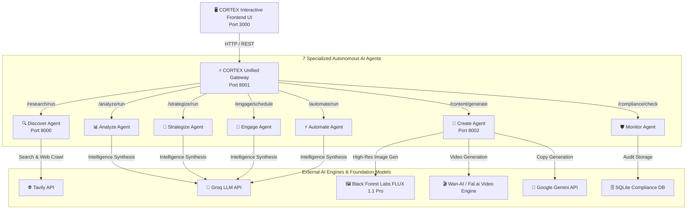

# 🌳 CORTEX — Autonomous AI Agent Ecosystem for Enterprise Insurance & Fintech

[](LICENSE)
[](https.python.org)
[](https://fastapi.tiangolo.com)
[](https://blackforestlabs.ai)
[](https://fal.ai)

> **CORTEX** is an enterprise-grade, multi-agent AI orchestration platform engineered for insurance and financial services across Southeast Asia (JA Assure). Built around a cinematic interactive **"Living Tree" UI**, CORTEX coordinates **7 specialized AI agents** to manage the entire lifecycle of market intelligence, strategic planning, dynamic asset generation (text, high-fidelity images, and video reels), campaign execution, automation workflows, and regulatory compliance.

---

## 📐 Architecture & System Overview

CORTEX operates a distributed microservices model coordinated through a unified **API Gateway (Port 8001)**.



---

## 🤖 The 7 Core Autonomous AI Agents

### 1. 🔍 Discover Agent — Market Intelligence & Crawling
- **Objective**: Deep-scans regional insurance trends, competitor moves, regulatory updates, and consumer sentiment across Southeast Asia.
- **Engine**: Powered by Tavily API and automated web scrapers.
- **Outputs**: Structuring raw web data into categorized insights (`market_trend`, `competitor_move`, `regulatory_update`).

### 2. 📊 Analyze Agent — Pattern Synthesis & Anomaly Detection
- **Objective**: Synthesizes findings from the Discover Agent, detects market anomalies, calculates opportunity/risk scores (0–100), and outputs actionable verdicts.
- **Engine**: Groq LLM / Deep Pattern Engine.
- **Outputs**: Key pattern extraction, market signal directional confidence (Bullish/Bearish/Neutral), risk register, and strategic analyst verdicts.

### 3. 🎨 Create Agent — Generative Copy & Multi-Modal Asset Studio
- **Objective**: Converts analytical insights into platform-customized marketing copy, high-fidelity graphics, and promotional video reels.
- **Integrated Service Sub-Modules**:
  - **Copy Engine**: Generates platform-tuned copy for **LinkedIn**, **Instagram**, **X (Twitter)**, and **Video Scripts**.
  - **BFL FLUX Image Engine** (`bfl_SsEEjNO70rReBsUWreONjbqrNs5osd92`): Leverages **Black Forest Labs FLUX 1.1 Pro** to generate studio-grade insurance visuals and fallback dark glassmorphic cards.
  - **Wan-AI Video Engine** (`a9f30a17c295afe21f0a1a7742da1bc2`): Produces high-resolution promotional video clips and reels.

### 4. 💬 Engage Agent — Social Publishing & Audience Nurturing
- **Objective**: Formulates a 2-week multi-platform posting calendar, channel-specific posting schedules, engagement tactics (e.g. comment seeding, story polls), hashtag strategies, and weekly impression goals.
- **Engine**: Groq LLM Engagement Planner.

### 5. 🎯 Strategize Agent — Executive Roadmap & ROI Projection
- **Objective**: Builds comprehensive 16-week growth roadmaps with prioritized strategic pillars (P1/P2/P3), milestone phases, baseline vs target KPIs, risk registers, and ROI forecasts (Conservative / Base Case / Optimistic).
- **Engine**: Groq Strategic Planning Engine.

### 6. ⚡ Automate Agent — Multi-Agent Workflow Orchestration
- **Objective**: Coordinates event-driven automation pipelines between all agents (e.g. automatically passing approved content through the Monitor Agent into the Engage calendar).
- **Engine**: Automated Rule Evaluation & Latency Tracker.

### 7. 🛡️ Monitor Agent — Compliance & SQLite Governance Gate
- **Objective**: Audits all generated copy and assets against a **4-Lens Governance Framework**:
  1. **MAS Regulatory Compliance** (Singapore MAS guidelines).
  2. **Brand Voice & Tone Alignment**.
  3. **Claims Accuracy & Risk Transparency**.
  4. **Fraud & Misrepresentation Shield**.
- **Engine**: Rule-based audit gate with instant SQLite audit logging.

---

## 🎨 Interactive "Living Tree" Frontend UI

The CORTEX UI is designed with a **cinematic glassmorphism aesthetic** featuring an interactive **Living Tree of Intelligence**:

- **Dynamic Environment Engine**: Automatically transitions lighting, backdrop, and atmosphere based on time of day (Morning, Afternoon, Dusk, Midnight) or user selection.
- **Interactive Apple Hotspots**: 7 floating glowing fruit nodes on the canopy represent each agent, triggering live workspace modals upon interaction.
- **Subterranean Underground Root System**: SVG parallax roots beneath the ground line symbolize subterranean database connections and compliance pipelines.
- **Ambient Spore System**: Canvas/DOM floating spore particles that react to user hovering and movement.

---

## 🌐 API Gateway Endpoint Reference

All services are accessible through the **CORTEX Gateway** at `http://localhost:8001`.

| Endpoint | Method | Description | Sample Payload |
| :--- | :--- | :--- | :--- |
| `/health` | `GET` | Gateway & microservice health status | None |
| `/research/run` | `POST` | Trigger Discover Agent research run | `{"brand": "JA Assure", "market": "Singapore"}` |
| `/analyze/run` | `POST` | Run Analyze Agent synthesis | `{"brand": "JA Assure", "market": "Singapore"}` |
| `/content/generate` | `POST` | Generate multi-platform copy | `{"research_insight": {"topic": "Term Insurance"}}` |
| `/content/generate-image` | `POST` | BFL FLUX image generation | `{"prompt": "JA Assure digital tree visual"}` |
| `/content/generate-video` | `POST` | Wan-AI video generation | `{"prompt": "JA Assure video reel"}` |
| `/engage/schedule` | `POST` | Generate 2-week social calendar | `{"brand": "JA Assure", "platforms": ["LinkedIn"]}` |
| `/strategize/run` | `POST` | Generate 16-week executive roadmap | `{"brand": "JA Assure", "goal": "Market Growth"}` |
| `/automate/run` | `POST` | Trigger automation pipeline | `{"pipeline_name": "Cross-Agent Content Sync"}` |
| `/compliance/check` | `POST` | Audit content with 4-lens gate | `{"content": "JA Assure insurance", "region": "SG"}` |

---

## ⚙️ Environment Variables Setup

Create a `.env` file in the root directory (and in `cortex/backend/.env` & `cortex-content-agent-main/.env`):

```env
# Image & Video Generation API Keys
BFL_API_KEY=bfl_SsEEjNO70rReBsUWreONjbqrNs5osd92
VIDEO_API_KEY=a9f30a17c295afe21f0a1a7742da1bc2

# AI Model Provider Keys
GROQ_API_KEY=your_groq_api_key_here
TAVILY_API_KEY=your_tavily_api_key_here
GEMINI_API_KEY=your_gemini_api_key_here

# System Settings
PORT=8001
ENVIRONMENT=development
```

---

## 🚀 Local Quickstart Guide

### Prerequisites
- **Python**: 3.11+
- **Node.js**: (Optional, for HTTP static serving)

### 1. Start the Research Agent Service (Port 8000)
```bash
cd project1-brain-1
python -m uvicorn main:app --host 0.0.0.0 --port 8000
```

### 2. Start the Content & Media Service (Port 8002)
```bash
cd cortex-content-agent-main/cortex-content-agent-main
python -m uvicorn app.main:app --host 0.0.0.0 --port 8002
```

### 3. Start the CORTEX Gateway (Port 8001)
```bash
cd cortex/backend
python -m uvicorn main:app --host 0.0.0.0 --port 8001
```

### 4. Serve the Frontend Web Application (Port 3000)
```bash
cd cortex/frontend
python -m http.server 3000
```

Once all processes are running, open your web browser to:
👉 **`http://localhost:3000`**

---

## 📁 Repository Directory Breakdown

```
atang/
├── cortex/
│   ├── backend/               # Gateway microservice (main.py, routers, proxy endpoints)
│   └── frontend/              # Web Application (index.html, css/, js/cortex-app.js, js/api.js)
├── Ja_assure_vertex/          # Discover Agent core implementation & Tavily search integration
├── cortex-content-agent-main/ # Create Agent & BFL FLUX / Wan-AI media generation pipelines
├── project1-brain-1/          # Monitor Agent, compliance database & SQLite governance gate
├── outputs/                   # Directory storing generated images, video reels, & fallback assets
└── README.md                  # Project Documentation
```

---

## 🛡️ License & Acknowledgments

- **Brand**: Engineered for **JA Assure** Enterprise Insurance.
- **Image Engine**: Powered by **Black Forest Labs (FLUX 1.1 Pro)**.
- **Video Engine**: Powered by **Wan-AI / Fal.ai Video Engine**.
- **LLM Intelligence**: **Groq 120B** & **Google Gemini API**.
- **Search Engine**: **Tavily Web Intelligence**.

Developed by **Antigravity AI Engineering**.
